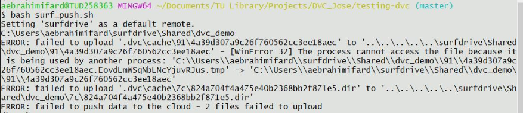

# Setting up dvc with surfdrive using local remote
Surfdrive provides 500GB to every TU Delft staff, employee and researcher.
Some researchers work wit large files which could be handled in version control worflows using git and dvc.

**We believe that surfdrive and dvc could be used to collaborate on version control, of large data files, as an alternative to google drive for TU Delft users**

## Experiment
In order to test this we created a shared folder among three collaborators in surfdrive. All collaborators need full access rights to this folder. Each collaborator will set the shared surfdrive in their local file system as a dvc remote. Then collaborators will be able to push and pull changes to this local remotes, which need to be sync with the surfdrive cloud storage. [Read more about dvc local remotes](https://dvc.org/doc/command-reference/remote)

## Success metrics
- How easy it is to setup the collaboration with dvc
- How fast surf syncs the local remotes that each collaborator has in her/his pc

## We are right if
- DVC files and folders are not corrupted do to surfdrive sync processes.

## What we observed
- The dvc local remote is being set with an absolute path because the shared surfdrive directory lives in a different location of our system which might differ per operating system . This means that the setup of the local remote will differ. We found two possible ways to handle it. 1) Each collaborator adds a remote name like this `dvc add remote surf_<name> `. 2) Use a bash script that wraps this command and uses a `.env` file where the specific path of the surfdrive folder is written.Then we add a remote to make dvc push or pull and then remove the remote. (The `.env` is private to each collaborator).    

## What we learned
- Dvc pull worked fine when first collaborator created the dvc repository
- Dvc push from 2nd collaborator also worked
- We have to close the surf desktop app otherwise it intervenes in the process. We did this two times, with the app opened, the app will start the syncing process and will block dvc from writing in the local remote. 

**This is still a concern:**
- Will files remain uncorrupted in all local remote holded by different collaborators?

## What we recommend
- Use the bash script to push and pull to the remote remotes

## Todo
- Describe step by step how this is done